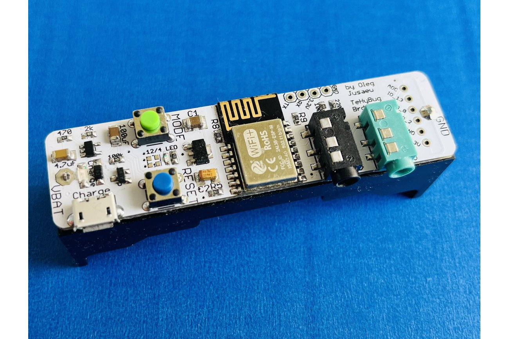
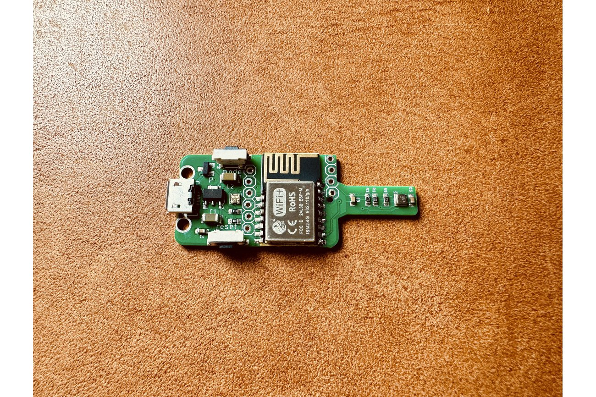
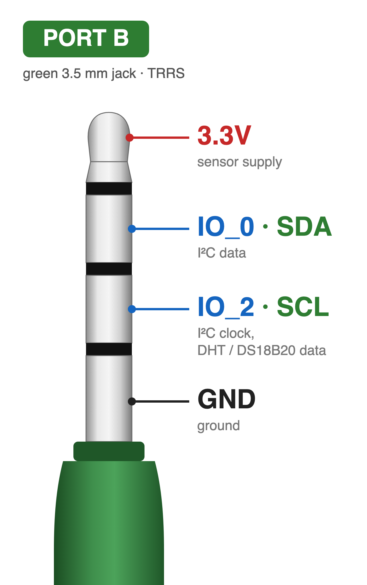
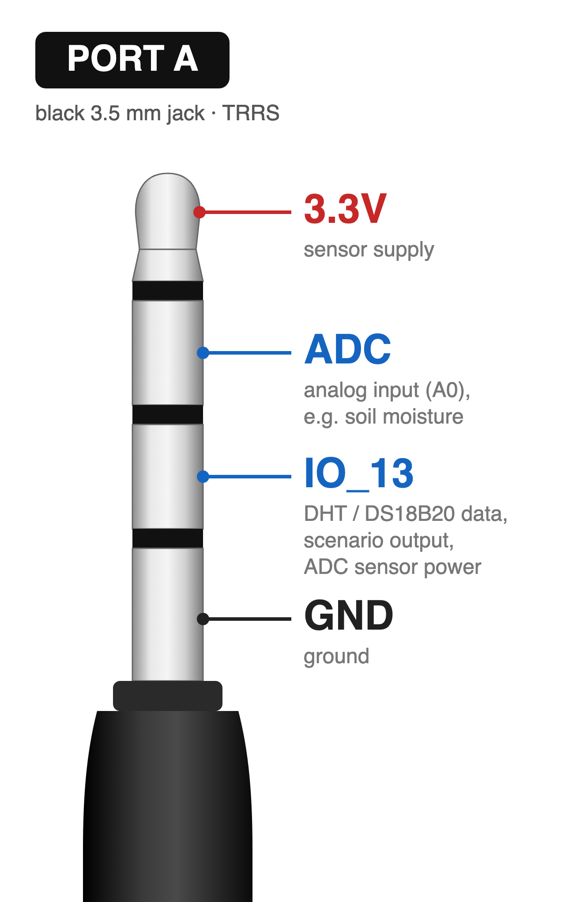
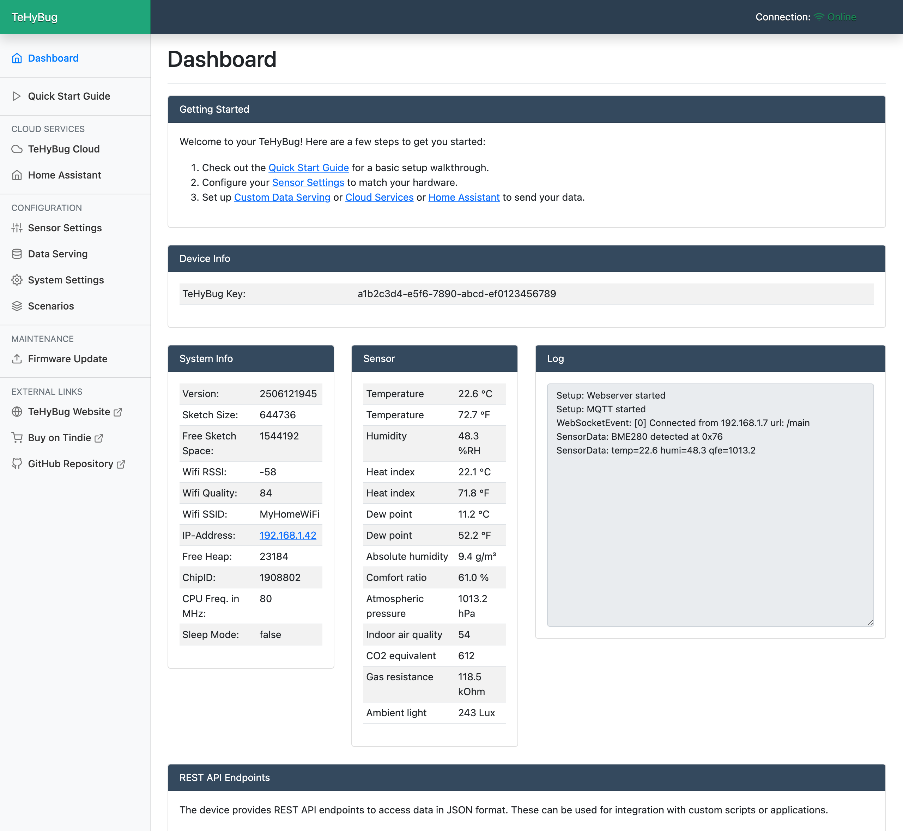
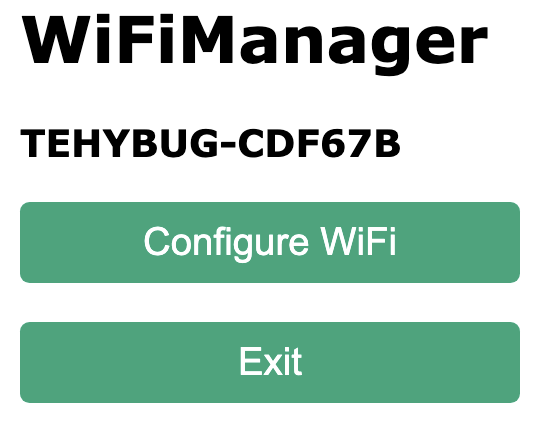
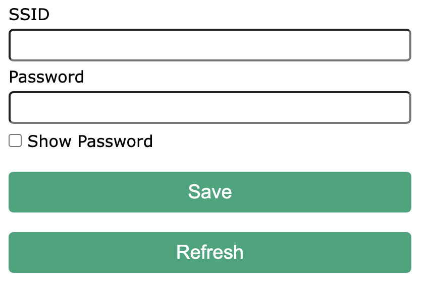

This is a different TeHyBug firmware fully written in C/C++, (previous was partially in Lua).

This firmware supports easy OTA Updates.



TeHyBug 18650 Universal




Mini TeHyBug


This firmware is compatible with tehybug universal boards (without display) like:
* TeHyBug 18650 Universal v1 (esp-01 based) and v2 (esp-m based)
* Mini TeHyBug
* Gumboard 
* or other TeHyBug boards with have audio jack connector for the sensors
* It is also compatible with any other ESP8266/ESP8285 dev boards like wemos, lolin, nodemcu etc. See the pin mapping images. Only the indicator led will not work and the power saving mode with deep sleep will probably not work either.

## Buttons
- Reset: forces TeHyBug to reboot/restart
- Mode button: activates the configuration mode. Press it **after** the device has booted, not while pressing RESET — the MODE button is on GPIO0, so holding it down during reset puts the ESP into firmware-flash (UART download) mode instead.

## Device Modes
- Live mode: when your device is configured to serve data (via http/mqtt) and you enable the powersaving deep sleep and deactivate the config mode in the system settings. 

- Config mode: TeHyBug serves a web interface at http://tehybug.local where you can configure everything.

- Offline mode (requires the RTC + EEPROM module): the device never connects to WiFi. It wakes on the log interval, measures, appends one entry to the on-device log and deep-sleeps again — the lowest possible power draw with no network. See [Offline data logging](#offline-data-logging-rtc--eeprom) below.


To return back to Config mode from the Live mode (or Offline mode):
1. hit the RESET button and release it — do **not** hold MODE yet (holding MODE during reset boots the ESP into flash mode)
2. in Offline / deep-sleep modes the LED then glows white for a few seconds — this is the window to use the MODE button
3. while the LED is white, push and hold the MODE button untill it turns blue
4. release the MODE button.

## Offline data logging (RTC + EEPROM)

With a DS3231 RTC + I²C EEPROM module attached, TeHyBug can store timestamped readings on the device itself — no server, broker or network required. Configure and read the log on the **Data Log** page of the web interface.

- **One file per day, a full month retained.** A file per day of month is written. The 32 KB EEPROM (FT24C256A) is split into 32 slots of ~1 KB each, so every day of the month gets its own file; when no free slot is left the oldest day file is recycled.
- **Pick what to log.** Store the default measured set, or a custom placeholder template (e.g. `%temp% %humi%`) to keep only the fields you care about.
- **Compact format.** To fit more into the small slots (~1 KB each) the date is omitted — it is implied by the file name — and each value is tagged with a short code, e.g. `07:55 22.6t 48.3h 1013.2p`. This roughly doubles the entries per day file versus a verbose `key=value` line.
- **Own log interval.** The log frequency is independent of the data-serving intervals; in offline mode it also sets the deep-sleep interval. A day file holds a limited number of entries, so pick an interval that fits a full day — the Data Log page shows a capacity table and, once a day file is full, the rest of that day is not recorded.
- **Offline mode.** Enabling offline mode logs with WiFi completely off. The web interface is unavailable while offline; to read the data, press RESET then hold MODE until the LED turns blue to re-enter Config mode.

> Not available on the Mini TeHyBug / generic build, which has no RTC/EEPROM hardware.

## Port B (green) supported sensors:
* BME680
* BME280/BMP280
* DHT21/DHT22/AM2032 (in dht simulation mode)
* AHT20
* MAX44009
* DS18B20
* other i2c and one wire sensors (requires code modification)
  
### Pinmapping Port B
  


## Port A (black) supported sensors:
* DHT21/DHT22/AM2032 (in dht simulation mode)
* DS18B20
* ADC soil moisture sensor
* other ADC and one wire sensors (requires code modification)

### Pinmapping Port A
  


## Upload new firmware via web interface (recommended)

To update the firmware from OTA WebInterface open http://tehybug.local/update in your browser, if this doesnt work, try to find out its IP from your router admin menu or use any local network ip scanner app for your mobile phone to get the device ip and then open http://<ip_address<ip address>>/update with your browser.

## Firmware binaries
The prebuilt binaries in the repository root are rebuilt automatically on every merge to `main`:

| File | Board | Notes |
| --- | --- | --- |
| `tehybug.ino.esp8285.bin` | TeHyBug universal boards (ESP8285) | recommended |
| `tehybug.ino.esp8285_debug.bin` | TeHyBug universal boards (ESP8285) | serial debug output enabled |
| `tehybug.ino.generic.bin` | Mini TeHyBug / generic ESP8266 dev boards (1MB flash) | small enough for OTA updates; no BME680, no RTC/EEPROM data log, no https data push (plain http works) |

## How to program/flash the board (advanced users only)
To flash firmware use the .esp8285.bin file.
For flashing and programming you can use ARDUINO IDE, select there generic ESP8285 board.
Also you can use the [ESPTool](https://github.com/espressif/esptool) to flash binaries to the board or other tools which are described at: https://nodemcu.readthedocs.io/en/latest/flash/

Replace /dev/cu.usbserial-1410 with your usb2serial port.

```esptool.py --port=/dev/cu.usbserial-1410  write_flash 0x00000 desired_tehybug_firmware.bin```


## Web Gui
  


Demo web configuration page: https://tehybug.com/tehybug/v1/html/demo.html

## Configuration first steps
- Connect an external sensor to the board 3,5mm audio jack connector.
- Connect the power supply to micro USB port
- TeHyBug will boot, the LED will turn solid blue
- Connect to a TeHyBug wifi network like the image below (Password: TeHyBug123)
- 
- open http://192.168.4.1/ in your browser, and click the configuration button
- 
- Provide credentials of your WIFI network and save them
- If your credentials were correct, the TeHyBug WIFI network will disapear
- TeHyBug will connect to your network and boot in a configuration mode with solid blue LED light
- open with your browser http://tehybug.local/ and the configuration page should open. (if this didnt work. Find out the TeHyBug IP Addres from your router and open it with yoour browser)
- Follow the instructions on the configuration page.

## Factory reset
To delete the all the configs and reset wifi configuration.

1. hit the RESET button
2. after that push and hold the MODE button for 20 seconnds untill the LED turns red
3. release the MODE button.

## Building from source

Requirements: [arduino-cli](https://arduino.github.io/arduino-cli/) and git. Everything else is pinned:

- All Arduino libraries are vendored in [`libraries/`](libraries/) — exact known-good versions, including a PubSubClient patched to `MQTT_MAX_PACKET_SIZE 4000` (required for the Home Assistant discovery messages).
- [`ci/install-deps.sh`](ci/install-deps.sh) installs the ESP8266 core 2.7.4 and applies the `platform.local.txt` override needed to link the precompiled BSEC (BME680) library.

```bash
./ci/install-deps.sh        # one-time: install the ESP8266 toolchain
./build.sh                  # build for ESP8285 (default)
./build.sh all              # build esp8285 + generic
./build.sh esp8285 debug    # build with serial debug output
```

The flashable binary is placed next to the sketch as `tehybug.ino.<variant>.bin`.

## Development

Active development happens on the `development` branch. Every pull request to `main` is built by GitHub Actions ([build workflow](.github/workflows/build.yml)) and the resulting binaries are attached as workflow artifacts. After a merge to `main`, the workflow rebuilds all firmware variants, commits the updated binaries back to the repository and publishes a [release](https://github.com/gumslone/tehybug-universal/releases) with the binaries attached. The release tag (`vYYMMDDHHMM`) matches the firmware version reported by the device.
