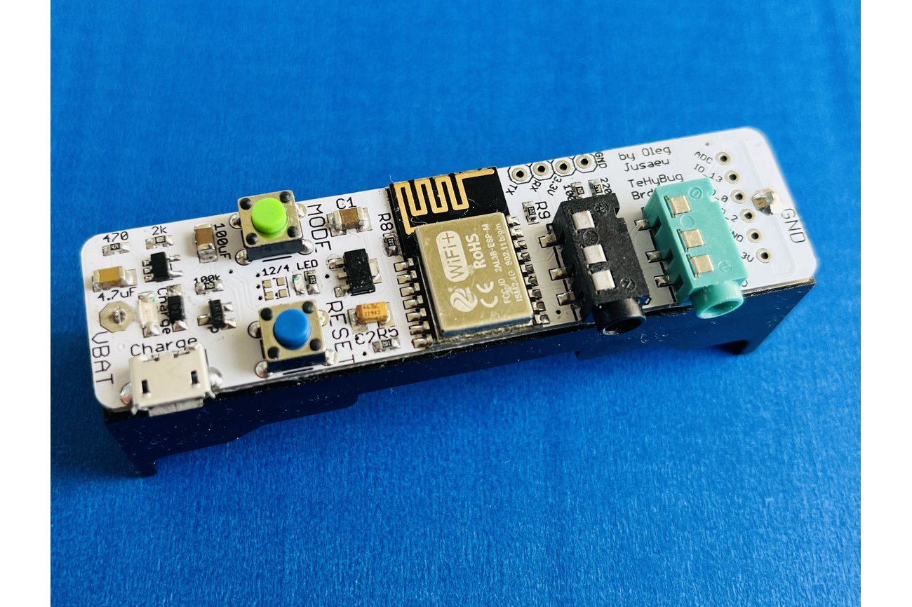
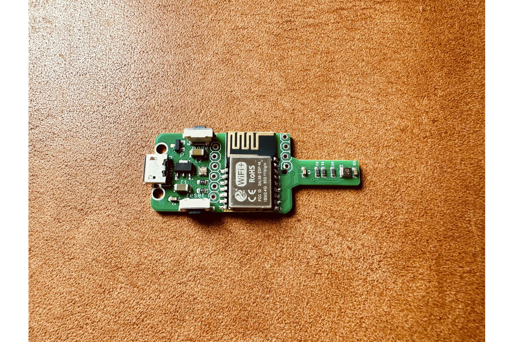
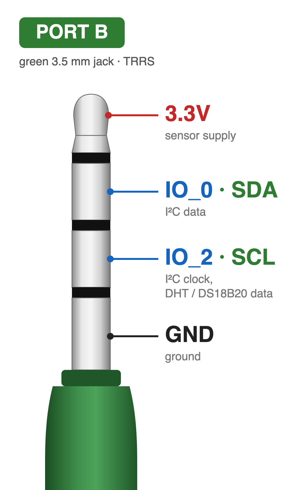
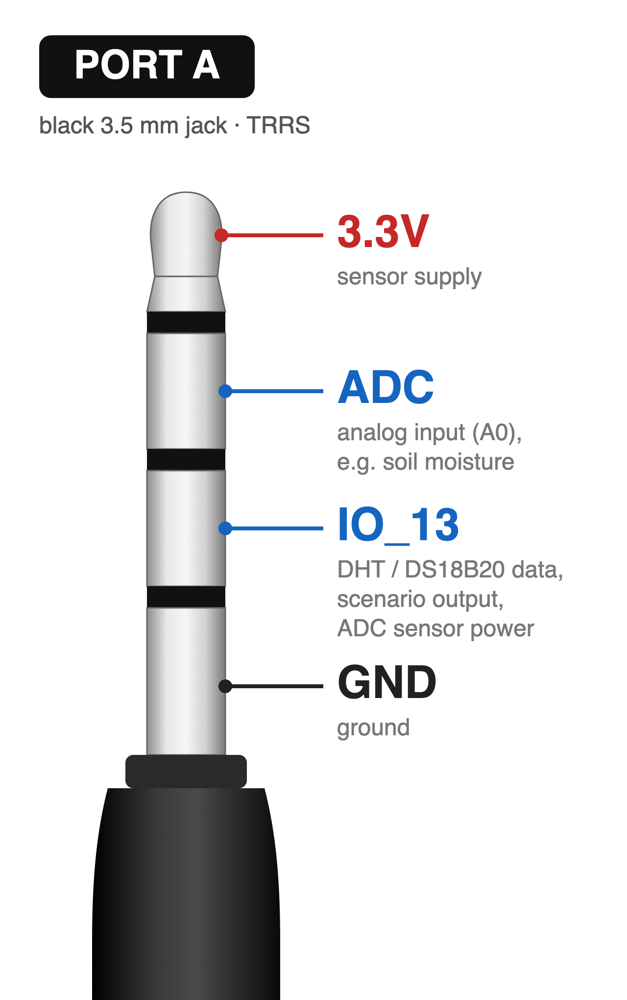
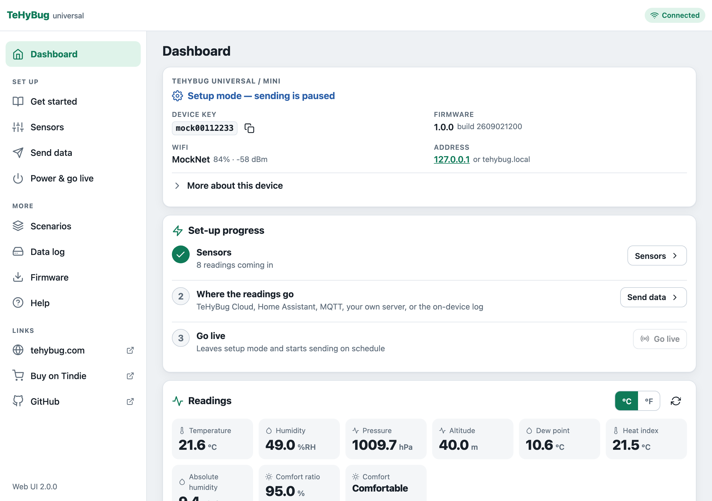
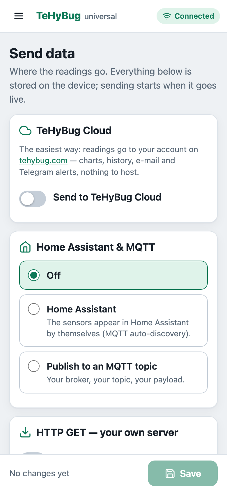
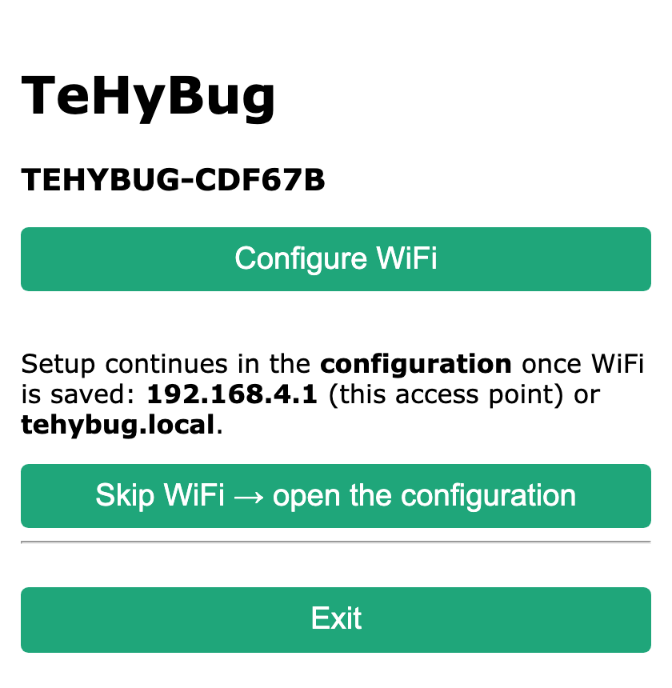
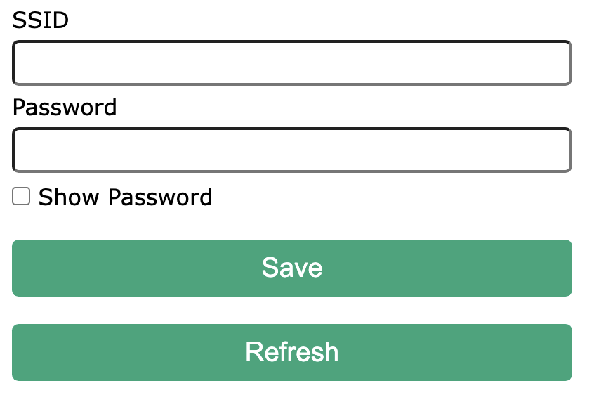

This is a different TeHyBug firmware fully written in C/C++, (previous was partially in Lua).

This firmware supports easy OTA Updates.



TeHyBug 18650 Universal




Mini TeHyBug (ESP8285 — uses the `esp8285` firmware build, same as the universal)


This firmware is compatible with tehybug universal boards (without display) like:
* TeHyBug 18650 Universal v1 (esp-01 based) and v2 (esp-m based)
* Mini TeHyBug
* Gumboard 
* or other TeHyBug boards with have audio jack connector for the sensors
* It is also compatible with any other ESP8266/ESP8285 dev boards like wemos, lolin, nodemcu etc. See the pin mapping images. Only the indicator led will not work and the power saving mode with deep sleep will probably not work either.

The **TeHyBug Display Weatherstation** ([tindie](https://www.tindie.com/products/25408/)) is supported by its own build of this same firmware — flash `firmware/tehybug.ino.display.bin`. See [Display Weatherstation](#display-weatherstation-oled--clock--alarms) below.

## Buttons
- Reset: forces TeHyBug to reboot/restart
- Mode button: activates the configuration mode. Press it **after** the device has booted, not while pressing RESET — the MODE button is on GPIO0, so holding it down during reset puts the ESP into firmware-flash (UART download) mode instead.

## Device Modes
- Live mode: when your device is configured to serve data (via http/mqtt) and you enable the powersaving deep sleep and deactivate the config mode in the system settings. 

- Config mode: TeHyBug serves a web interface at http://tehybug.local where you can configure everything. (First-generation / 1 MB boards don't include mDNS — reach them by IP address instead; the device's own page at http://192.168.4.1 shows it.)

- Offline mode (requires the RTC + EEPROM module): the device never connects to WiFi. It wakes on the log interval, measures, appends one entry to the on-device log and deep-sleeps again — the lowest possible power draw with no network. See [Offline data logging](#offline-data-logging-rtc--eeprom) below.


To return back to Config mode from the Live mode (or Offline mode):
1. hit the RESET button and release it — do **not** hold MODE yet (holding MODE during reset boots the ESP into flash mode)
2. right after the device boots, push and hold the MODE button untill the LED turns blue
3. release the MODE button.

The device waits **1 second** after a reset for a MODE press. Scheduled deep-sleep wake-ups skip this wait (it would cost battery on every wake, and nobody can time a press into one), and on some boards a RESET pressed **while the device is asleep** is indistinguishable from a timer wake — so if the LED never turns blue after step 2, **press RESET twice about a second apart**, then hold MODE. The second press is always recognised.

## Offline data logging (RTC + EEPROM)

With a DS3231 RTC + I²C EEPROM module attached, TeHyBug can store timestamped readings on the device itself — no server, broker or network required. Configure and read the log on the **Data Log** page of the web interface.

- **One file per day, a full month retained.** A file per day of month is written. The EEPROM is split into 32 slots, so every day of the month gets its own file; when no free slot is left the oldest day file is recycled. The chip size is detected at boot: current modules carry a 64 KB FT24C512A (~2 KB per day file), earlier ones a 32 KB FT24C256A (~1 KB). The Data Log page shows which was found. **Upgrading a 64 KB module from an older firmware re-lays out the log once and erases what was stored — download anything you want to keep first.**
- **Log period (month or day).** The default keeps a rolling month (one file per day of month). Switch to **per-hour** logging on the Data Log page for a rolling 24 hours at finer detail (one file per hour of day, reused the next day). Changing the period wipes the log automatically so it starts clean in the new layout.
- **Pick what to log.** Store the default measured set, or a custom placeholder template (e.g. `%temp% %humi%`) to keep only the fields you care about.
- **Compact format.** To fit more into the small slots the date is omitted — it is implied by the file name — and each value is tagged with a short code, e.g. `07:55 22.6t 48.3h 1013.2p`. This roughly doubles the entries per day file versus a verbose `key=value` line.
- **Own log interval.** The log frequency is independent of the data-serving intervals; in offline mode it also sets the deep-sleep interval. A day file holds a limited number of entries, so pick an interval that fits a full day — the Data Log page shows a capacity table. When a day file fills up it wraps: it clears and starts again from the top, overwriting that day's earlier entries (so logging never stops; you keep the most recent readings).
- **Offline mode.** Enabling offline mode logs with WiFi completely off. The web interface is unavailable while offline; to read the data, press RESET then hold MODE until the LED turns blue to re-enter Config mode (press RESET twice if the LED doesn't react — see "Return to Config mode" above).

> Available in the ESP8285 build (TeHyBug universal and Mini) when an RTC + EEPROM module is attached. The slim generic (1MB) build for old / first-generation boards omits the RTC/EEPROM driver entirely.

## Display Weatherstation (OLED + clock + alarms)

The [TeHyBug Display Weatherstation](https://www.tindie.com/products/25408/) (ESP8285, 1.3&Prime; SH1106 OLED, DS3231 real-time clock with battery backup, buzzer, WS2812B indicator, three buttons, two sensor ports) runs the `display` build of this firmware — it replaces the separate `tehybug_display_c_firmware_v1`, whose configuration (display lines, clock options, alarms, even "WiFi off") carries over on upgrade.

On top of everything above (sensors, MQTT/Home Assistant, cloud, scenarios, data log) the display build adds:

- **Clock page** — date, big time with blinking colon (24 h or 12 h with am/pm), your first two template lines as a live footer, and the device's IP in tiny type along the edge so it is always findable.
- **Sensor page** — three freely configurable `%placeholder%` template lines.
- **Three weekday alarms** — time + weekday schedule + message; the buzzer alternates two tones and the display shows the message until any button mutes it.
- **Night mode** — the panel switches off inside a configurable window (may cross midnight); alarms and data serving keep running.
- **Offline display mode** — WiFi completely off, clock and sensors keep running. Toggle it by holding the right (IO_5) button for 10 seconds (LED turns purple, device restarts).

Configure it all on the **Display &amp; Alarms** page of the web interface (it appears automatically for display devices). Set the clock there once — the DS3231 keeps it on its backup battery.

Buttons on the display board:

| Button | Press | Action |
| --- | --- | --- |
| Left / Right | click | switch clock/sensor page, or mute a ringing alarm |
| Right (IO_5) | hold 10 s | toggle offline display mode (WiFi off/on, purple LED, restart) |
| MODE (top) | press after RESET | config mode (blue LED) — do **not** hold it during reset, that is the chip's flash mode |
| MODE (top) | hold 20 s | factory reset (red LED) |
| RESET | click | reboot |

> Port note: on the display board the OLED and RTC occupy the I²C bus (Port B pins), so DHT/DS18B20 on Port B are not available there — use Port A (readings appear as `%temp2%` / `%humi2%`) or any I²C sensor. The SGP30 air-quality sensor (`%tvoc%` / `%eco2%`) is supported, as it was in the old display firmware.

## Port B (green) supported sensors:

> Port B shares its pins with the I²C bus. While a DHT or DS18B20 is enabled here, I²C sensors **and the RTC + EEPROM data-log module are not detected** — put the sensor on Port A if you want the data log alongside it. Readings appear as `%temp%` / `%humi%`.

* BME680
* BME280/BMP280
* DHT21/DHT22/AM2032 (in dht simulation mode)
* AHT20
* MAX44009
* DS18B20
* other i2c and one wire sensors (requires code modification)
  
### Pinmapping Port B
  


## Port A (black) supported sensors:

> Port A has its own pin, so it leaves the I²C bus free — the data-log module keeps working alongside. It fits **one** sensor (DHT, DS18B20 *or* ADC). Readings appear as `%temp2%` / `%humi2%`.

* DHT21/DHT22/AM2032 (in dht simulation mode)
* DS18B20
* ADC soil moisture sensor
* other ADC and one wire sensors (requires code modification)

### Pinmapping Port A
  


## Upload new firmware via web interface (recommended)

To update the firmware from OTA WebInterface open http://tehybug.local/update in your browser, if this doesnt work, try to find out its IP from your router admin menu or use any local network ip scanner app for your mobile phone to get the device ip and then open http://<ip_address<ip address>>/update with your browser.

## Firmware binaries
The prebuilt binaries in [`firmware/`](firmware/) are rebuilt automatically on every merge to `main`:

| File | Board | Notes |
| --- | --- | --- |
| `firmware/tehybug.ino.esp8285.bin` | TeHyBug universal (v2) and Mini TeHyBug (ESP8285) | recommended |
| `firmware/tehybug.ino.esp8285_debug.bin` | TeHyBug universal / Mini (ESP8285) | serial debug output enabled |
| `firmware/tehybug.ino.display.bin` | TeHyBug Display Weatherstation (ESP8285 + SH1106 OLED) | everything the esp8285 build has, plus the display, clock, alarms and buzzer |
| `firmware/tehybug.ino.display_debug.bin` | TeHyBug Display Weatherstation | serial debug output enabled |
| `firmware/tehybug.ino.generic.bin` | Old / first-generation TeHyBug boards (esp-01 based, generic ESP8266, 1MB flash) | slimmed to fit 1MB and stay OTA-updatable; no BME680 or SGP30, no RTC/EEPROM data log, no Home Assistant discovery, no https data push (plain http works), one sensor port (no Port A, no ADC). Plain MQTT, http GET/POST and scenarios all work |

## How to program/flash the board (advanced users only)
To flash firmware use the `firmware/tehybug.ino.esp8285.bin` file.
For flashing and programming you can use ARDUINO IDE, select there generic ESP8285 board.
Also you can use the [ESPTool](https://github.com/espressif/esptool) to flash binaries to the board or other tools (e.g. [NodeMCU PyFlasher](https://github.com/marcelstoer/nodemcu-pyflasher)) which are described at: https://nodemcu.readthedocs.io/en/latest/flash/

Flashing is handled by **[BugZapper](https://github.com/gumslone/bugzapper)**, a
standalone flasher (GUI + CLI) included here as a git submodule at
[`tools/bugzapper`](tools/bugzapper). A pure-python esptool + pyserial are
bundled in it, so **no install is needed — just `python3`** (a system esptool is
used instead if found). Clone with submodules, or fetch it after cloning:

```sh
git clone --recurse-submodules <repo>     # or, in an existing clone:
git submodule update --init
```

`flash.sh` and `bugzapper.sh` at the repo root are thin wrappers that run
BugZapper against this repo's `firmware/` folder with TeHyBug branding.

### CLI: `flash.sh`
```sh
./flash.sh                    # flash the first firmware/*.bin to the auto-found port
./flash.sh -e                 # erase all flash first ("yes, wipes all data")
./flash.sh -p /dev/cu.usbserial-110 -b 460800
./flash.sh -f firmware/tehybug.ino.esp8285_debug.bin
./flash.sh -h                 # all options
```

### GUI: BugZapper (`bugzapper.sh`)
Prefer a window? [`bugzapper.sh`](bugzapper.sh) launches **TeHyBug BugZapper** — a
single window with the flasher options (port, firmware, baud, flash mode, erase)
**and a built-in serial monitor** (ANSI colors, live baud switching, send-to-serial,
save/log-to-file), so you never hit the separate-PyFlasher-+-CoolTerm "port busy"
clash. After a flash it reopens the monitor to show the boot log.

```sh
brew install python-tk@3.10   # tkinter, one-time (any python-tk works)
./bugzapper.sh
```

### Using esptool directly
Replace /dev/cu.usbserial-1410 with your usb2serial port.

```esptool.py --port=/dev/cu.usbserial-1410  write_flash 0x00000 desired_tehybug_firmware.bin```


## Web Gui
  
 

The web interface is built for phones first (the pictures are the mock device in `tools/`; captured with `tools/screenshot.js`).

Demo of the web interface (a simulated device, nothing to flash): https://tehybug.com/tehybug/v2/demo.html — add `?board=display` for the Display Weatherstation pages.

## Configuration first steps
- Connect an external sensor to the board 3,5mm audio jack connector.
- Connect the power supply to micro USB port
- TeHyBug will boot, the LED will turn solid blue
- Connect to a TeHyBug wifi network like the image below (Password: TeHyBug123)
- 
- open http://192.168.4.1/ in your browser, and click the configuration button
- 
- Provide credentials of your WIFI network and save them
- If your credentials were correct, the TeHyBug WIFI network will disapear
- TeHyBug will connect to your network and boot in a configuration mode with solid blue LED light
- open with your browser http://tehybug.local/ and the configuration page should open. (if this didnt work. Find out the TeHyBug IP Addres from your router and open it with your browser. First-generation / 1MB boards have no mDNS, so always use the IP there — the device's own page at http://192.168.4.1/ shows it.)

Then, on the web interface:

1. **Sensors** — switch on the sensor(s) you attached (I²C sensors are detected automatically), and check the readings appear on the Dashboard.
2. **Send data** — TeHyBug Cloud, Home Assistant, MQTT, or your own server by HTTP, all on one page. The *"Fill from my sensors"* links build the MQTT payload / POST body / GET query from the sensors this device actually reports, in °C or °F. Save.
3. **Go live** — the button on the Dashboard (or on *Power & go live*): pick the power mode (Deep sleep for battery) and confirm. The device restarts and starts sending; on battery boards the web interface stops being served, which is expected. The Dashboard's set-up checklist shows which of the three steps are done.
4. **Getting back in later** — press RESET, then MODE within a second (see "Return to Config mode" above). A device that has nothing configured to serve always starts its setup portal, so it can't lock you out.

### HTTPS certificate check (optional)
An `https://` target (HTTP GET/POST, scenarios) is encrypted either way, but by default the device does not verify the server's certificate: an ESP8266 has no trusted clock to validate a certificate chain against. What it can do is **pin the certificate**: on *Send data → HTTPS certificate check*, enter the SHA-1 fingerprint of your server's certificate (from the browser's certificate viewer, or `openssl s_client -connect host:443 -servername host </dev/null | openssl x509 -noout -fingerprint -sha1`) and the device refuses to send to anything else. One fingerprint covers all HTTPS targets. Certificates get renewed — Let's Encrypt about every two months — after which the sends fail (the dashboard log shows the TLS reason) until you update the pin. MQTT has no TLS; the 1 MB build for first-generation boards has no TLS client at all.

## Factory reset
To delete all the configs, reset the wifi configuration and erase the on-device data log (the RTC + EEPROM module, if attached).

1. hit the RESET button
2. after that push and hold the MODE button for 20 seconds untill the LED turns red
3. release the MODE button.

The EEPROM data log is wiped only after the MODE button is released (it shares the I²C line with the button).

## Repository layout

- [`tehybug-universal.ino`](tehybug-universal.ino) — the sketch (entry point), at the repo root
- [`src/`](src/) — the firmware module headers; the sketch includes them as one translation unit
- [`firmware/`](firmware/) — prebuilt, flashable binaries
- [`libraries/`](libraries/) — vendored Arduino libraries (pinned, known-good versions)
- [`html/`](html/) — the PHP/JS/CSS configuration web UI (hosted at tehybug.com)
- [`tests/`](tests/) — native host tests + clang-tidy static analysis
- [`build.sh`](build.sh) / [`platformio.ini`](platformio.ini) — the two build paths
- [`flash.sh`](flash.sh) / [`bugzapper.sh`](bugzapper.sh) — wrappers that run the BugZapper flasher (CLI / GUI) against this repo's firmware
- [`tools/bugzapper/`](tools/bugzapper) — the [BugZapper](https://github.com/gumslone/bugzapper) flasher, included as a git submodule (bundles esptool + pyserial)

## Building from source

Requirements: [arduino-cli](https://arduino.github.io/arduino-cli/) and git. Everything else is pinned:

- All Arduino libraries are vendored in [`libraries/`](libraries/) — exact known-good versions, including a PubSubClient patched to `MQTT_MAX_PACKET_SIZE 4000` (required for the Home Assistant discovery messages).
- [`ci/install-deps.sh`](ci/install-deps.sh) installs the ESP8266 core 2.7.4 and applies the `platform.local.txt` override needed to link the precompiled BSEC (BME680) library.

```bash
./ci/install-deps.sh        # one-time: install the ESP8266 toolchain
./build.sh                  # build for ESP8285 (default)
./build.sh display          # build for the Display Weatherstation
./build.sh all              # build esp8285 + display + generic
./build.sh esp8285 debug    # build with serial debug output
```

The flashable binary is placed in `firmware/` as `firmware/tehybug.ino.<variant>.bin`.

### PlatformIO

[`platformio.ini`](platformio.ini) mirrors the same board options, flags and
vendored libraries, so the project also builds with [PlatformIO](https://platformio.org/).
Either drive it directly:

```bash
pio run -e esp8285        # universal board (recommended)
pio run -e display        # Display Weatherstation
pio run -e generic        # old/first-gen TeHyBug / 1 MB
pio run -e esp8285_debug  # with serial debug output
```

…or pick the backend from `build.sh` with the `TOOL` env var (same variant /
mode arguments, so one command line works for both tools):

```bash
./build.sh esp8285                    # arduino-cli (default)
TOOL=platformio ./build.sh esp8285    # same build via PlatformIO
TOOL=platformio ./build.sh all debug  # esp8285_debug + generic_debug
```

The sketch stays at the repo root (so the arduino-cli build is unchanged);
PlatformIO compiles it as a single translation unit and writes its output to
`.pio/build/<env>/firmware.bin`. The arduino-cli `build.sh` remains the
reference the CI release uses.

### Tests

The hardware-independent firmware logic (the EEPROM data log + date index, the
`common_functions` helpers, I²C device detection, the boot/serve decision
logic, and the display board's page/alarm/clock decisions) has native host
tests that run on a desktop compiler — no board or Arduino toolchain needed —
plus a clang-tidy static-analysis pass. See [`tests/`](tests/README.md):

```bash
./tests/run.sh    # native host tests (fake I²C EEPROM; 700+ assertions)
./tests/tidy.sh   # clang-tidy over the host-compilable headers
```

## Development

Active development happens on the `development` branch.

Every push and pull request runs the [tests workflow](.github/workflows/tests.yml):
the native host tests, the clang-tidy static analysis, and a PlatformIO build of
the `esp8285` and `generic` environments.

Every pull request to `main` is also built by the [build workflow](.github/workflows/build.yml)
(arduino-cli) and the resulting binaries are attached as workflow artifacts. After a merge to
`main`, that workflow rebuilds all firmware variants, commits the updated binaries back to
the repository and publishes a [release](https://github.com/gumslone/tehybug-universal/releases)
with the binaries attached. The release tag (`v1.0.0`, `v1.1.0`, ...) matches the
semantic firmware version the device reports (`FW_VERSION` in
[`src/fw_version.h`](src/fw_version.h)) — bump it as part of a change to publish a
release; a merge that leaves it unchanged only refreshes the committed binaries.
(Releases before v1.0.0 used compile-timestamp tags, `vYYMMDDHHMM`; the device
still reports that timestamp separately as its exact build id.)
